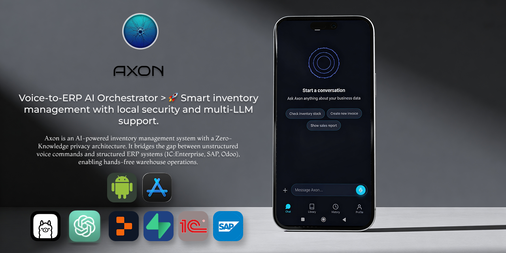

<div align="center">



# AXON

### Voice-to-ERP AI Orchestrator

[](https://github.com/Melik1986/Axon-App/actions)
[](LICENSE)
[](#)
[](https://expo.dev)
[](https://reactnative.dev)
[](https://nestjs.com)
[](https://www.typescriptlang.org)

**AI-powered inventory management with Zero-Knowledge privacy architecture.**  
Bridges unstructured voice commands and structured ERP systems (1C:Enterprise, SAP, Odoo).

</div>

---

## 🎯 What is AXON?

AXON transforms how businesses interact with ERP systems. Instead of navigating complex menus, users simply **speak** or **show** what they need. The AI agent translates natural language into structured API calls, making enterprise software accessible to everyone—from warehouse workers to CEOs.

### Supported LLM Providers

[](https://openai.com)
[](https://groq.com)
[](https://ollama.ai)
[](https://openrouter.ai)
[](https://together.ai)

### Supported ERP Systems

[](https://1c.ru)
[](https://sap.com)
[](https://odoo.com)
[](https://moysklad.ru)

---

## ✨ Key Features

| Feature                        | Description                                                        |
| ------------------------------ | ------------------------------------------------------------------ |
| 🎤 **Voice-First Interface**   | Speak naturally to check stock, create invoices, or move inventory |
| 📷 **Vision AI**               | Scan invoices, price tags, barcodes — auto-create documents        |
| 🔌 **Universal ERP Connector** | Works with any ERP via OpenAPI/Swagger or OData                    |
| 📚 **RAG Knowledge Base**      | "Talk" to your regulations and manuals via Qdrant                  |
| 🔒 **Zero-Knowledge Privacy**  | Sensitive data encrypted on-device; only context reaches LLM       |
| 📴 **Offline-First**           | Local storage ensures operations continue without internet         |
| 🤖 **BYO-LLM**                 | Bring your own LLM provider — configure via app settings           |
| 🔗 **MCP Support**             | Model Context Protocol for external tool integration               |

---

## 🛠 Tech Stack

<table>
<tr>
<td align="center" width="96">

<br>React Native
</td>
<td align="center" width="96">

<br>Expo SDK 55
</td>
<td align="center" width="96">

<br>NestJS
</td>
<td align="center" width="96">

<br>TypeScript
</td>
<td align="center" width="96">

<br>PostgreSQL
</td>
<td align="center" width="96">

<br>Supabase
</td>
</tr>
<tr>
<td align="center" width="96">

<br>Vercel AI SDK
</td>
<td align="center" width="96">

<br>Qdrant
</td>
<td align="center" width="96">

<br>Drizzle ORM
</td>
<td align="center" width="96">

<br>SQLite
</td>
<td align="center" width="96">

<br>Docker
</td>
<td align="center" width="96">

<br>CI/CD
</td>
</tr>
</table>

---

## 📱 Modules

### 🎤 Jarvis Voice

Record audio via `expo-av`, transcribe with **Whisper**, execute commands via function calling.

```
User: "Покажи остатки молока на складе Центральный"
Axon: Найдено 3 позиции: Молоко 2.5% — 120 шт, Молоко 3.2% — 85 шт...
```

### 📷 Jarvis Vision

Analyze photos of invoices and price tags with **GPT-4o Vision** → auto-create documents in ERP.

```
User: *uploads photo of invoice*
Axon: Распознана накладная №1234 от 15.01.2025. Создать приходный документ?
```

### 📚 RAG Knowledge Base

Search internal instructions and company regulations stored in **Qdrant** vector database.

```
User: "Как оформить возврат товара?"
Axon: Согласно регламенту §3.2: Возврат оформляется через документ...
```

---

## 🚀 Quick Start

### Prerequisites

- Node.js v22+
- PostgreSQL (or Supabase)
- Expo Go app (for mobile testing)
- Docker (optional, for gitleaks)

### Installation

```bash
# Clone the repository
git clone https://github.com/Melik1986/Axon-App.git
cd Axon-App

# Install dependencies
npm install

# Copy environment template
cp .env.example .env
# Edit .env with your EXPO_PUBLIC_DOMAIN

# Start the server
npm run start:server:dev

# In another terminal — start mobile app
npm start
```

### Configuration

All secrets (LLM keys, ERP credentials, Supabase, Qdrant) are configured via:

- **App UI**: Settings screen, MCP Servers screen
- **Replit**: Secrets panel
- **Hosting**: Environment variables dashboard

---

## 🏗 Architecture

```
┌─────────────────────────────────────────────────────────────────┐
│                        AXON Mobile App                          │
│  ┌─────────────┐  ┌─────────────┐  ┌─────────────┐             │
│  │  Voice UI   │  │  Vision UI  │  │   Chat UI   │             │
│  └──────┬──────┘  └──────┬──────┘  └──────┬──────┘             │
│         │                │                │                     │
│         └────────────────┼────────────────┘                     │
│                          ▼                                      │
│              ┌───────────────────────┐                          │
│              │    Zustand Store      │  ◄── Offline-First       │
│              │   (AsyncStorage)      │                          │
│              └───────────┬───────────┘                          │
└──────────────────────────┼──────────────────────────────────────┘
                           │ HTTPS/WSS
                           ▼
┌──────────────────────────────────────────────────────────────────┐
│                      NestJS Backend                              │
│  ┌──────────────┐  ┌──────────────┐  ┌──────────────┐           │
│  │  LLM Module  │  │  ERP Module  │  │  RAG Module  │           │
│  │ (AI SDK)     │  │ (OData/REST) │  │  (Qdrant)    │           │
│  └──────┬───────┘  └──────┬───────┘  └──────┬───────┘           │
│         │                 │                 │                    │
│         ▼                 ▼                 ▼                    │
│  ┌─────────────────────────────────────────────────────┐        │
│  │              AI Adapter Pattern                      │        │
│  │   Dynamic Tool Generation from OpenAPI/Swagger       │        │
│  └─────────────────────────────────────────────────────┘        │
└──────────────────────────────────────────────────────────────────┘
                           │
           ┌───────────────┼───────────────┐
           ▼               ▼               ▼
      ┌─────────┐    ┌─────────┐    ┌─────────┐
      │   1C    │    │   SAP   │    │  Odoo   │
      │  OData  │    │   API   │    │   API   │
      └─────────┘    └─────────┘    └─────────┘
```

---

## 🔒 Security

- **JWE (JSON Web Encryption)** for payload protection
- **Ephemeral Client Pool** for managing AI provider keys securely
- **Guardian Guard** for pre-execution validation of AI tool calls
- **Gitleaks** pre-commit hook for secret scanning

See [SECURITY.md](SECURITY.md) for reporting vulnerabilities.

---

## 🤝 Contributing

We welcome contributions! Please see [CONTRIBUTING.md](CONTRIBUTING.md) for guidelines.

---

## 📄 License

This project is licensed under the **GNU AGPLv3** License — see [LICENSE](LICENSE).

---

<div align="center">

**Built with ❤️ for the Replit Mobile Buildathon**

[](https://replit.com/new/github/Melik1986/Axon-App)

</div>
